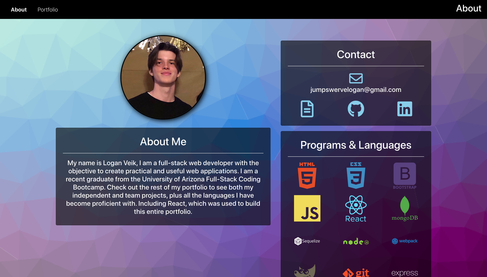
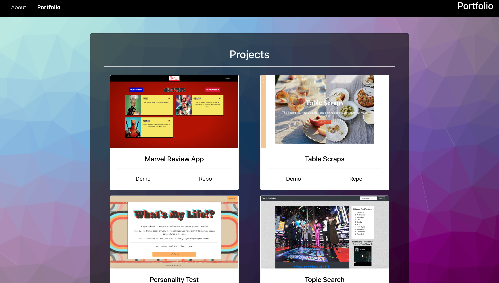

# Portfolio (Logan Veik)

### Links:
Demo - [https://ljvportfolio.netlify.app/](https://ljvportfolio.netlify.app/)
Repo - [https://github.com/loganveik/reactPortfolio](https://github.com/loganveik/reactPortfolio)

### Description:
My Professional Portfolio. This portfolio highlights industry-desired skills and accomplishments, displays my contact info, and showcases 6 successful applications which each include detailed descriptions and demo/repo links.

### Technologies Used:
React, Bootstrap4, CSS3, Javascript, NodeJS, Express.

### How to Use:
1) This is the "About" page where you'll find my contact info, newly-learned technologies, and a brief summary about me.

2) This is the "Portfolio" page which showcases 6 of the best and most up-to-date applications that have been built either idependently by me or with a collaborative team.
